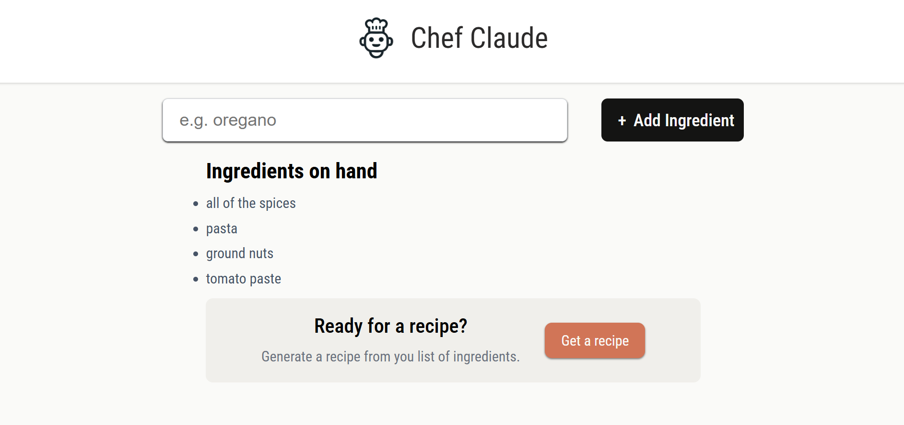

# 🍽️ React Recipe App

## Preview  

## 📌 Introduction
This is a **simple React application** that allows users to input a list of ingredients and receive a **possible recipe suggestion**.  
While an **AI model** could be integrated to generate recipes, this project focuses **solely on learning React** concepts rather than AI integration.

---

## ✨ Features
✅ Add ingredients to a list  
✅ Display the list of added ingredients  
✅ Conditionally show a recipe suggestion  
✅ Toggle recipe visibility  

---

## 🚀 Concepts Learned
Throughout building this project, I have learned and practiced the following **React concepts**:  
🔹 **JSX and Component Structure**  
🔹 **Props and State**  
🔹 **Mapping over Arrays**  
🔹 **Props vs State**  
🔹 **`useState` Hook**  
🔹 **Changing & Toggling State**  
🔹 **Handling Complex State (Arrays & Objects)**  
🔹 **React Forms & Event Handling**  
🔹 **Conditional Rendering**  
🔹 **Passing State as Props**  
🔹 **Setting State from a Child Component**  
🔹 **Local State vs Shared State**  

---

## 🎓 Acknowledgments  
Special thanks to **Scrimba** and **Bob Ziroll** for their fantastic React course, which helped me gain a solid understanding of these concepts. 🙌
